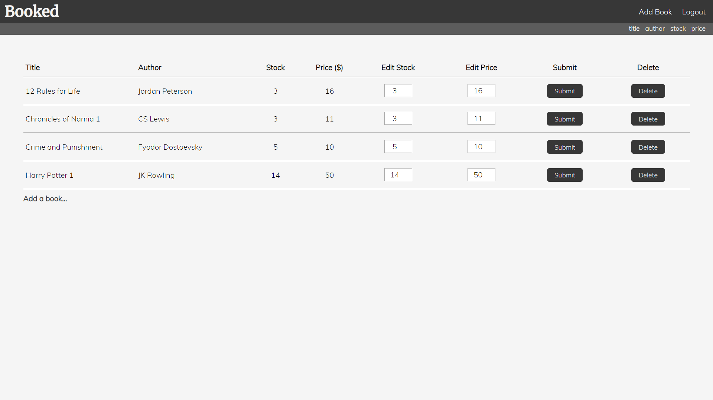
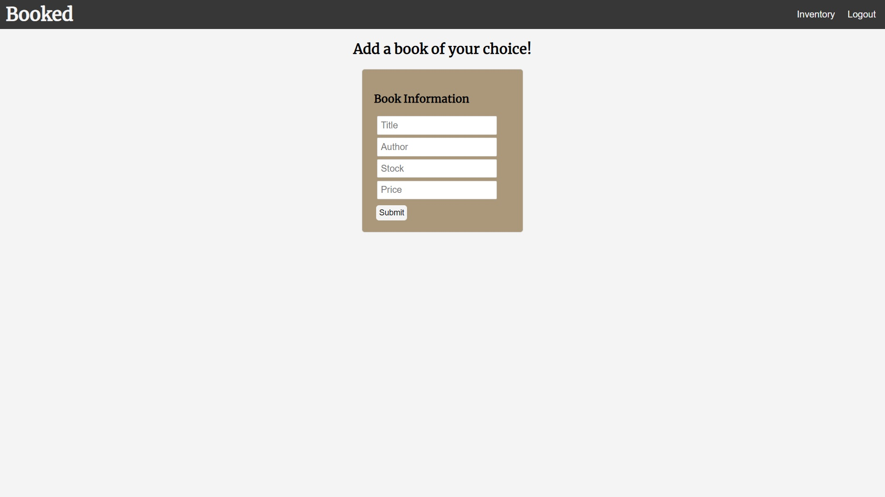

# Booked
An inventory application for printed materials 

Link to live page:  https://booked-inventory-app.herokuapp.com/

## Motivation
I wanted to make an application for my friend who runs a small bookstore. He would write inventory on paper,
which is why I decided he needed something a little more efficient. Though the main purpose of this application
is for a store, it can also be used for private collections of books. 

Home Page:

Inventory Page: 
 

Add Book Page:
 

## Technology Used:
### Front-End:
    1. HTML
    2. CSS
    3. JavaScript
    4. React
    5. Redux

### Back-end: 
    1. Node.js
    2. Express
    3. Mongo

